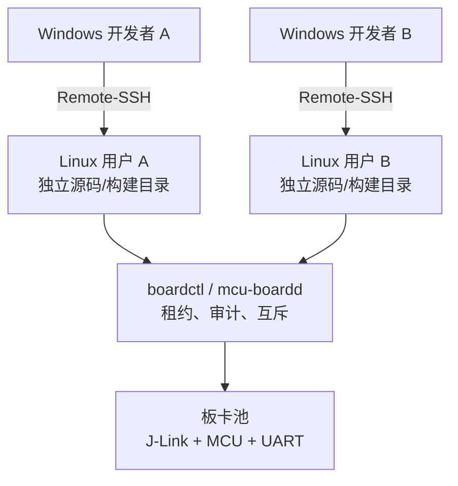

# Ubuntu 局域网多人 MCU 开发服务器实施手册

> 目标：Windows 开发者通过 VS Code Remote-SSH 登录 Ubuntu；一人一个 Linux 账号；可并行编辑和编译；J-Link、UART 和目标板属于受控共享资源；系统只有 `mcu-admin` 和 `mcu-dev` 两个业务角色组。

## 1. 最终架构与边界

推荐采用“远程工作区 + 板卡资源代理”的架构：



### 1.1 可以并行和不能并行的部分

| 资源 | 并发规则 |
|---|---|
| 编辑源码、Git 操作 | 每人独立工作区，可同时进行 |
| 编译、链接、静态检查 | 可同时进行，限制每人并行编译线程数 |
| 公共工具链、SDK | 多人只读共享，可同时使用 |
| 一套目标板 + 一只 J-Link | 同一时刻只允许一个用户持有 |
| 同一块板的 GDB 与 UART | 同一个租约持有人可以同时使用 |
| 多人同时硬件调试 | 需要多套“目标板 + 调试器”，每套独立编号 |

一只 J-Link 不能让两名开发者同时控制同一颗 MCU。软件锁只能排队，不能把一套物理硬件变成多套。若 5 人必须同时调试，应准备 5 套硬件。

### 1.2 两个业务角色组

Ubuntu 自带 `root`、`systemd-*`、`messagebus` 等系统组，不能也不应该删除。“只有两个用户组”在本方案中指只有两个业务权限角色：

| 业务组 | 成员 | 权限 |
|---|---|---|
| `mcu-admin` | 管理员和禁止登录的服务账号 `mcu-boardd` | 系统维护、安装工具、配置板卡、强制释放租约 |
| `mcu-dev` | 普通开发者 | SSH、自己的工作区、只读工具链、通过 `boardctl` 使用板卡 |

普通开发者不得加入 `sudo`、`adm`、`docker`、`dialout`、`plugdev`。尤其不要把普通用户加入 `docker` 组，因为该组事实上可取得接近 root 的控制能力。

## 2. 部署前规划

先填写以下清单，后续命令统一使用这些值：

| 项目 | 示例 |
|---|---|
| 服务器主机名 | `mcu-build-01` |
| 固定 IP | `192.168.10.20` |
| 局域网网段 | `192.168.10.0/24` |
| 管理员账号 | `mcuadmin` |
| 普通账号 | `caijia`、`dingwen`、`huwenhao`、`limengmeng` |
| 板卡编号 | `n32h760-a`、`n32g430-a` |
| J-Link 序列号 | 每只 J-Link 唯一序列号 |
| MCU 设备名 | 必须与 J-Link 数据库完全一致，例如 `N32H760xIx7` |
| UART 稳定路径 | `/dev/serial/by-id/...` |

建议在路由器上为服务器设置 DHCP 地址保留，比直接手写 Netplan 更不容易因网卡名变化而失联。服务器需要有线网络，不建议以 Wi-Fi 作为长期开发链路。

### 2.1 基础硬件建议

- CPU：按每 2～3 名开发者至少 4 个物理/高性能核心估算。
- 内存：每名普通 MCU 开发者预留 4～8 GiB；Zephyr/大型 C++ 工程应更多。
- 磁盘：NVMe SSD；系统和源码建议至少 1 TiB；准备独立备份盘或 NAS。
- 每套板卡应有独立 J-Link、独立 UART、独立供电，最好再有可远控 USB 继电器或 PDU。
- 每只 J-Link、UART 转换器都记录序列号，不按 `/dev/ttyUSB0` 这种易变化的名字管理。

## 3. 安装 Ubuntu 基础软件

本文以 Ubuntu 22.04 LTS 为基线，24.04 LTS 的命令相同。先更新系统：

```bash
sudo apt update
sudo apt full-upgrade
sudo reboot
```

重新登录后安装基础组件：

```bash
sudo apt install -y \
  openssh-server ufw acl git git-lfs rsync \
  build-essential cmake ninja-build ccache gdb-multiarch \
  python3 python3-venv python3-pip \
  libncurses-dev gperf device-tree-compiler \
  usbutils libusb-1.0-0 dfu-util \
  picocom socat tmux htop lsof jq

sudo systemctl enable --now ssh
```

如果要编译 Zephyr，再根据所用 Zephyr 版本安装其明确要求的 Python 包和 SDK，不要把未经审核的 Python 包全局 `sudo pip install` 到系统 Python。优先使用每个用户自己的虚拟环境。

## 4. 创建两个业务组和账号

### 4.1 创建角色组

```bash
sudo groupadd --force mcu-admin
sudo groupadd --force mcu-dev

# 查看所有组
cat /etc/group
```

### 4.2 创建管理员

以下示例创建管理员 `mcuadmin`，其主组直接设为 `mcu-admin`，不会创建同名私人组：

```bash
sudo useradd -m -d /home/mcuadmin -s /bin/bash -g mcu-admin mcuadmin
sudo passwd mcuadmin
sudo chmod 0700 /home/mcuadmin
```

创建管理员 sudo 规则：

```bash
sudo vim -f /etc/sudoers.d/10-mcu-admin
```

写入：

```sudoers
# ============================================
# MCU 开发环境 sudo 权限策略
# ============================================

# 1. 允许 mcu-admin 组成员执行任何命令（管理员特权）
#    适用于需要调试 J-Link、安装软件等操作的管理员账户。
%mcu-admin ALL=(ALL:ALL) ALL

# 2. 禁止 mcu-boardd 服务账户使用 sudo
#    该账户仅用于运行 mcu-boardd 守护进程，无需任何提权能力。
#    注意：确保 mcu-boardd 不属于 mcu-admin 组，否则本规则可能被覆盖。
mcu-boardd ALL=(ALL:ALL) !ALL
```

第二行用于阻止服务账号借助其 `mcu-admin` 主组取得管理员权限。保存后立即检查：

```bash
sudo chmod 0440 /etc/sudoers.d/10-mcu-admin
sudo vim -cf /etc/sudoers
sudo -l -U mcuadmin
```

不要退出当前管理员会话。另开一个终端，确认 `mcuadmin` 可以 SSH 登录并正常执行 `sudo -v`，再调整原安装账号的权限。

### 4.3 创建普通用户

以 `caijia` 为例：

```bash
# 1. 创建用户 caijia
#    -m               : 同时创建用户的家目录（默认 /home/caijia）
#    -d /home/caijia  : 显式指定家目录路径（与默认相同，可省略，但这里明确指定）
#    -s /bin/bash     : 设置登录 Shell 为 Bash
#    -g mcu-dev       : 指定用户的主组为 mcu-dev（该组必须已存在）
#    caijia           : 新创建的用户名
sudo useradd -m -d /home/caijia -s /bin/bash -g mcu-dev caijia

# 2. 为用户 caijia 设置登录密码
#    执行后会提示输入两次密码，密码将以加密形式存储
sudo passwd caijia

# 3. 强制用户首次登录时更改密码
#    -d 0  : 将上次密码修改日期设为 1970-01-01（即过期），
#            使得用户下次登录时立即被要求修改密码
sudo chage -d 0 caijia

# 4. 设置用户家目录权限为 0700
#    0700 表示：仅所有者（caijia）具有读、写、执行权限，
#    同组用户和其他用户均无任何访问权限，增强隐私和安全
sudo chmod 0700 /home/caijia
```

其余用户重复执行。若这些账号已经存在，先让用户退出，再迁移主组：

```bash
# 1. 修改用户 caijia 的主组为 mcu-dev
#    -g mcu-dev  : 将用户的主组（primary group）更改为 mcu-dev
#    该组必须已存在；修改后，用户新建文件的默认属组将变为 mcu-dev
#    注意：此操作不影响用户的附加组（secondary groups）
sudo usermod -g mcu-dev caijia

# 2. 设置用户 caijia 的家目录权限为 0700
#    0700 表示：仅所有者（caijia）具有读（r）、写（w）、执行（x）权限
#    同组用户和其他用户没有任何权限（---）
#    目的：保护用户私有数据，防止其他用户（包括同组成员）访问
#    注意：执行前确保 /home/caijia 已存在；若家目录刚刚创建，此操作为必要加固
sudo chmod 0700 /home/caijia
```

逐个检查，不要批量猜测谁是管理员：

```bash
# 1. 显示用户 caijia 的用户ID（UID）、主组ID（GID）以及所属的所有组（包括主组和附加组）
#    输出示例：uid=1001(caijia) gid=1002(mcu-dev) groups=1002(mcu-dev),1003(mcu-admin)
#    用途：快速确认用户的基本信息和组成员关系，排查权限问题。
id caijia

# 2. 从系统数据库（/etc/group 及可能的外部源）中查询组 mcu-admin 的详细信息
#    输出格式：组名:密码占位符:GID:成员列表（用逗号分隔）
#    示例输出：mcu-admin:x:1003:user1,user2
#    用途：查看 mcu-admin 组是否存在、GID 是多少，以及有哪些用户属于该组。
getent group mcu-admin

# 3. 查询组 mcu-dev 的详细信息（同上）
#    用途：确认 mcu-dev 组是否存在及其成员，常用于验证开发组配置。
getent group mcu-dev

# 4. 列出用户 caijia 被允许执行的 sudo 命令（即查看其 sudo 权限）
#    -U caijia : 指定要查询的用户
#    输出会显示该用户在 /etc/sudoers 及 /etc/sudoers.d/ 中拥有的所有授权规则。
#    如果用户没有任何 sudo 权限，则输出 "User caijia is not allowed to run sudo on ..."
#    用途：检查用户是否具备提权能力，验证 sudo 策略是否正确。
sudo -l -U caijia
```

普通用户不应出现在 `sudo`、`docker`、`dialout`、`plugdev` 中。若旧账号曾加入这些组，逐个移除，例如：

```bash
# 1. 将用户 caijia 从 sudo 组中移除
#    -d caijia  : 指定要移除的用户
#    sudo       : 目标组名（通常该组成员拥有完整的 sudo 权限）
#    用途：撤销用户 caijia 的 sudo 提权能力，将其从管理员组中删除。
sudo gpasswd -d caijia sudo

# 2. 将用户 caijia 从 dialout 组中移除
#    dialout 组通常用于访问串行设备（如 /dev/ttyUSB*、/dev/ttyACM*）
#    用途：阻止 caijia 直接读写串口设备，将串口访问权限限制给特定用户/组（如 mcu-dev）。
sudo gpasswd -d caijia dialout

# 3. 将用户 caijia 从 plugdev 组中移除
#    plugdev 组通常用于访问热插拔设备（如 USB 存储、某些调试器）
#    用途：限制 caijia 对即插即用设备的自动挂载/访问权限，增强系统安全性。
sudo gpasswd -d caijia plugdev
```

### 4.4 创建硬件服务账号

```bash
# 1. 创建一个系统用户 mcu-boardd（用于运行服务）
#    --system          : 创建系统用户（UID < 1000），无过期时间，通常用于守护进程
#    --home-dir /var/lib/mcu-boardd : 指定用户的家目录路径（服务的数据存储位置）
#    --create-home     : 如果家目录不存在则自动创建
#    --shell /usr/sbin/nologin : 设置登录 Shell 为 nologin，禁止交互式登录
#    --gid mcu-admin   : 指定用户的主组为 mcu-admin（该组必须已存在）
#    mcu-boardd        : 新创建的用户名
sudo useradd --system \
  --home-dir /var/lib/mcu-boardd \
  --create-home \
  --shell /usr/sbin/nologin \
  --gid mcu-admin \
  mcu-boardd

# 2. 锁定用户 mcu-boardd 的密码（禁止密码登录）
#    -l : lock，在密码字段前添加 "!"，使任何密码都无法通过验证
#    即使设置了密码，此操作会使其失效，增强安全性（该用户本就不应登录）
sudo passwd -l mcu-boardd

# 3. 设置用户家目录权限为 0750
#    0750 表示：所有者（mcu-boardd）具有读、写、执行权限（rwx）
#             同组用户（mcu-admin）具有读、执行权限（r-x）
#             其他用户没有任何权限（---）
#    目的：允许服务进程（运行在 mcu-boardd 用户下）和同组管理员访问该目录，
#         但禁止其他用户读取服务数据，保护敏感信息
sudo chmod 0750 /var/lib/mcu-boardd
```

该账号禁止登录、没有可用密码，只负责运行 J-Link、OpenOCD 和 UART 工具。

## 5. SSH 和防火墙

### 5.1 使用独立 SSH 配置片段

不要直接覆盖 `/etc/ssh/sshd_config`。创建：

```bash
sudoedit /etc/ssh/sshd_config.d/20-mcu-server.conf
```

内容：

```sshconfig
# ==========================================================
# SSH 登录安全配置
# 适用于多人 MCU 开发服务器
# 管理员组: mcu-admin
# 开发人员组: mcu-dev
# ==========================================================


# ----------------------------------------------------------
# 禁止 root 用户直接 SSH 登录
# 原因:
# 1. 避免 root 密码泄露导致整台服务器失陷
# 2. 强制使用普通账号 + sudo 提权
# 推荐:
#   mcuadmin 登录
#   sudo 执行管理员操作
# ----------------------------------------------------------
PermitRootLogin no


# ----------------------------------------------------------
# 禁止空密码账号登录
# 防止创建了无密码用户后被直接 SSH 登录
# ----------------------------------------------------------
PermitEmptyPasswords no


# ----------------------------------------------------------
# 允许密码方式 SSH 登录
# 当前阶段保留:
# Windows 用户通过:
#   ssh 用户名@服务器IP
# 输入密码登录
#
# 原因:
# 1. 初期部署方便
# 2. 方便多人账号验证
# 3. 避免一次修改导致所有用户无法登录
#
# 后续:
# 所有用户完成 SSH Key 配置后，
# 可以改为:
# PasswordAuthentication no
# ----------------------------------------------------------
PasswordAuthentication yes


# ----------------------------------------------------------
# 开启 SSH 公钥认证
# 支持后续切换 SSH Key 登录
#
# 用户公钥文件:
# ~/.ssh/authorized_keys
#
# 后续推荐:
# Windows VS Code Remote SSH + SSH Key
# ----------------------------------------------------------
PubkeyAuthentication yes


# ----------------------------------------------------------
# 启用 PAM 模块
#
# Ubuntu 默认依赖 PAM 完成:
# - 用户认证
# - 密码策略
# - 登录限制
#
# 不建议关闭
# ----------------------------------------------------------
UsePAM yes


# ==========================================================
# 用户访问控制
# ==========================================================


# ----------------------------------------------------------
# 只允许指定用户组登录 SSH
#
# 允许:
#   mcu-admin  管理员
#   mcu-dev    MCU开发人员
#
# 不属于这两个组的用户:
#   即使用户名和密码正确，也无法 SSH 登录
#
# 例如:
# nobody
# test
# 临时账号
# ----------------------------------------------------------
AllowGroups mcu-admin mcu-dev


# ----------------------------------------------------------
# 明确禁止指定用户 SSH 登录
#
# 即使该用户属于允许组，也拒绝登录
#
# 用于:
# - 废弃账号
# - 服务账号
# - 特殊限制账号
#
# 注意:
# 用户名必须真实存在
# ----------------------------------------------------------
DenyUsers mcu-boardd


# ==========================================================
# SSH 转发功能限制
# ==========================================================


# ----------------------------------------------------------
# 禁止 X11 图形界面转发
#
# MCU服务器主要用于:
# - 编译
# - 调试
# - 烧录
# - VS Code Remote SSH
#
# 不需要图形程序远程显示
#
# 关闭可以减少攻击面
# ----------------------------------------------------------
X11Forwarding no


# ----------------------------------------------------------
# 禁止 SSH Agent 转发
#
# 防止客户端 SSH 私钥代理被服务器滥用
#
# 安全考虑关闭
# ----------------------------------------------------------
AllowAgentForwarding no


# ----------------------------------------------------------
# 限制 TCP Forwarding
#
# local:
#   允许本地端口转发
#
# 禁止:
#   remote forwarding
#   动态代理
#
# 避免服务器成为网络跳板
# ----------------------------------------------------------
AllowTcpForwarding local


# ----------------------------------------------------------
# 禁止 GatewayPorts
#
# 禁止 SSH 转发端口监听在公网地址
#
# 防止:
# 用户建立隐藏代理服务
# ----------------------------------------------------------
GatewayPorts no


# ----------------------------------------------------------
# 禁止 SSH Tunnel
#
# 不允许建立 VPN 类隧道
# ----------------------------------------------------------
PermitTunnel no


# ==========================================================
# 登录行为限制
# ==========================================================


# ----------------------------------------------------------
# 单次 SSH 登录最大认证次数
#
# 防止暴力破解密码
#
# 例如:
# 密码连续错误超过5次
# SSH断开
# ----------------------------------------------------------
MaxAuthTries 5


# ----------------------------------------------------------
# 单个 SSH 连接允许的最大会话数
#
# 防止一个账号无限创建 shell/session
#
# 例如:
# 一个用户打开大量终端
# ----------------------------------------------------------
MaxSessions 10


# ----------------------------------------------------------
# SSH 保活机制
#
# 每60秒发送一次检测包
#
# 用于发现:
# - 网络断开
# - VPN断开
# - Windows休眠
# ----------------------------------------------------------
ClientAliveInterval 60


# ----------------------------------------------------------
# 最大无响应次数
#
# 连续3次无响应:
#
# 60秒 × 3 = 180秒
#
# SSH服务器主动断开连接
#
# 防止僵尸SSH连接长期占用资源
# ----------------------------------------------------------
ClientAliveCountMax 3
```

这里保留了当前需要的用户名 + 密码登录。后续所有 Windows 端都验证通过后，可以逐步切换 SSH 密钥，但不应在同一次操作里立即关闭密码登录。

修改后先检查再加载：

```bash
# 1. 检查 SSH 服务器配置文件（sshd_config）的语法是否正确
#    -t : test mode，只进行配置语法检查，不实际启动服务
#    如果配置有误，会输出错误信息；无输出则代表语法正确。
#    建议在修改配置后、重启服务前执行此命令，避免因配置错误导致服务无法启动。
sudo sshd -t

# 2. 重新加载 SSH 服务配置，使修改生效而不中断现有连接
#    reload : 平滑重载，主进程会重新读取配置文件，新连接使用新配置，
#            已建立的连接不受影响（比 restart 更友好）。
#    注意：服务名称可能为 ssh 或 sshd，具体取决于发行版；Ubuntu 通常使用 ssh。
sudo systemctl reload ssh

# 3. 查看当前 SSH 服务的有效配置，并过滤出关键安全/权限参数
#    sshd -T : 显示所有有效的配置项（包括默认值和从配置文件读取的值）
#    grep ... : 过滤出以下四项配置：
#      - PasswordAuthentication      : 是否允许密码登录
#      - PermitRootLogin             : 是否允许 root 用户登录
#      - AllowGroups                 : 允许登录的用户组列表（若未设置则不显示）
#      - AllowTcpForwarding          : 是否允许 TCP 转发（端口转发）
#    用途：快速验证当前配置是否符合安全策略，确认修改已生效。
sudo sshd -T | grep -E 'passwordauthentication|permitrootlogin|allowgroups|allowtcpforwarding'
```

`AllowTcpForwarding local` 要保留，VS Code Remote-SSH 需要 SSH 转发能力。不要设置为 `no`。

## 6. 目录和权限模型

> 本版本已经按当前服务器实际目录调整：
> Arm GNU Toolchain 位于 `/opt/arm-toolchain/arm-gnu-toolchain-13.2.Rel1-x86_64-arm-none-eabi`
> J-Link当前使用 `/opt/SEGGER/JLink`
> 自定义 J-Link 设备库的管理员维护源目录为 `/opt/SEGGER/JLinkDevices`

### 6.1 目录布局

```text
/home/<user>/workspace/                                                  每人的独立源码和构建目录
/opt/arm-toolchain/                                                      Arm GNU Toolchain 根目录
/opt/arm-toolchain/arm-gnu-toolchain-13.2.Rel1-x86_64-arm-none-eabi/     当前已安装的 Arm GNU Toolchain 13.2.Rel1
/opt/SEGGER/JLink/                                                       当前使用的 J-Link 可执行文件目录
/opt/SEGGER/JLinkDevices/                                                管理员维护的自定义 J-Link 设备库源目录
/opt/SEGGER/JLink_V968/                                                  已存在的 J-Link V9.68 版本目录，留作版本留存/回滚
/etc/mcu-boards/                                                         板卡定义，root 管理
/var/lib/mcu-boardd/                                                     服务账号 HOME 和 J-Link 自定义设备库
/run/mcu-boardd/                                                         重启即清空的租约、PID 和互斥锁
/var/log/mcu-boardd/                                                     调试服务器日志
```

### 6.2 检查现有工具目录

`/opt/arm-toolchain` 和 `/opt/SEGGER` 已经存在。执行以下命令检查现有工具目录是否可读：

```bash
# 1. 检查 ARM 嵌入式交叉编译工具链是否已安装
#    test -d : 测试指定路径是否为目录，若不存在则返回非零退出码
#    该目录包含 arm-none-eabi-gcc、gdb 等工具，用于编译 MCU 固件
#    若测试失败，需从 ARM 官网下载并解压到该路径
sudo test -d /opt/arm-toolchain/arm-gnu-toolchain-13.2.Rel1-x86_64-arm-none-eabi

# 2. 检查 SEGGER J-Link 软件包（包含 JLinkExe、JLinkGDBServer 等工具）
#    该目录通常由 J-Link 安装包创建，提供调试器驱动和命令行工具
#    若不存在，需从 SEGGER 官网下载并安装（如 .deb 或 .tgz 包）
sudo test -d /opt/SEGGER/JLink

# 3. 检查 J-Link 设备支持文件目录（存放芯片描述 XML 和 FLM 文件）
#    该目录包含各种 MCU 型号的定义文件，用于 J-Link 识别和烧录
#    若不存在，可能是安装不完整或版本较旧，可从安装包中提取或同步
sudo test -d /opt/SEGGER/JLinkDevices

# 4. 检查特定版本的 J-Link 软件目录（版本 V968，用于确认具体版本）
#    此处用于验证系统是否安装了 V968 版本，以便与配置中的版本号匹配
#    若实际目录名不同（如 JLink_V970），需相应调整环境变量中的引用
sudo test -d /opt/SEGGER/JLink_V968
```

如果现有工具目录不是管理员维护的只读目录，再执行以下权限收紧命令；
执行前先用`ls -ld` 核对路径，避免把错误目录纳入命令：

```bash
# 1. 列出多个目录的详细信息（所有者、组、权限、大小、修改时间等）
#    -l : 长格式显示，包含权限、所有者、组、大小、日期
#    -d : 只显示目录本身信息，不进入目录显示其内容
#    用途：在执行权限修改前，先查看当前状态以便验证后续变更是否成功。
ls -ld \
  /opt/arm-toolchain/arm-gnu-toolchain-13.2.Rel1-x86_64-arm-none-eabi \
  /opt/SEGGER/JLink \
  /opt/SEGGER/JLinkDevices \
  /opt/SEGGER/JLink_V968

# 2. 递归地将指定目录及其所有子文件/子目录的所有者（owner）和组（group）设为 root
#    -R : 递归处理所有子目录和文件
#    root:root : 第一个 root 为用户名，第二个 root 为组名
#    目的：将系统级工具链和软件包统一由 root 管理，防止普通用户篡改关键二进制文件。
sudo chown -R root:root \
  /opt/arm-toolchain/arm-gnu-toolchain-13.2.Rel1-x86_64-arm-none-eabi \
  /opt/SEGGER/JLink \
  /opt/SEGGER/JLinkDevices \
  /opt/SEGGER/JLink_V968

# 3. 递归设置目录及文件的权限：
#    -R : 递归
#    a+rX : 所有用户（a）增加读权限（r），并且对目录增加执行权限（X，仅对目录或已有执行权限的文件生效）
#    go-w : 属组（g）和其他用户（o）去除写权限（w）
#    组合效果：所有用户可以读取和进入（目录）这些文件，但只有 root 有写权限，
#    保护系统安装目录不被非授权用户修改，同时保证普通用户可以执行 J-Link 工具和读取头文件。
sudo chmod -R a+rX,go-w \
  /opt/arm-toolchain/arm-gnu-toolchain-13.2.Rel1-x86_64-arm-none-eabi \
  /opt/SEGGER/JLink \
  /opt/SEGGER/JLinkDevices \
  /opt/SEGGER/JLink_V968
```

### 6.3 源码原则

- 不允许所有人直接编辑同一个工作目录。
- 每个人在 `~/workspace/<project>` 拥有独立 Git working tree。
- 通过分支、提交、合并请求或团队现有 Git 远端协作。
- `build/`、`.venv/`、`.cache/` 都在用户自己的 HOME 中。
- 禁止把编译输出放到多人共同可写的同一个目录，否则会出现目标文件互相覆盖和不可复现构建。

### 6.4 工具链只读共享

当前服务器已经安装了 Arm GNU Toolchain 13.2.Rel1，实际根目录为：

```bash
# 1. 设置环境变量 ARM_GNU_ROOT，指向 ARM 嵌入式交叉编译工具的安装根目录
#    该路径包含 bin/、lib/、include/ 等子目录，用于存放 arm-none-eabi-gcc、gdb 等工具
#    后续命令通过该变量引用工具，便于路径管理和迁移
export ARM_GNU_ROOT=/opt/arm-toolchain/arm-gnu-toolchain-13.2.Rel1-x86_64-arm-none-eabi

# 2. 测试 arm-none-eabi-gcc 编译器是否存在且可执行
#    test -x : 检查文件是否存在且具有可执行权限
#    若文件不存在或不可执行，则返回非零退出码，后续脚本可据此判断环境是否完整
#    通常用于脚本中的前置条件检查
test -x "$ARM_GNU_ROOT/bin/arm-none-eabi-gcc"

# 3. 测试 arm-none-eabi-gdb 调试器是否存在且可执行
#    与上一条类似，用于验证调试工具是否可用
test -x "$ARM_GNU_ROOT/bin/arm-none-eabi-gdb"

# 4. 运行 arm-none-eabi-gcc 并显示其版本信息
#    --version : 输出编译器版本、版权信息等
#    用于确认工具链的实际版本，检查是否与预期一致（如 13.2.Rel1）
#    同时也能隐含验证该工具确实可执行（若无错误输出则说明正常）
"$ARM_GNU_ROOT/bin/arm-none-eabi-gcc" --version
```

创建 `/etc/profile.d/mcu-tools.sh`：

```bash
# 1. 设置 ARM 交叉编译工具链的根目录
#    指向已安装的 arm-gnu-toolchain 路径，其中包含 bin/、lib/ 等子目录
#    后续通过此变量引用编译器、调试器等工具，便于版本切换和路径统一管理
export ARM_GNU_ROOT=/opt/arm-toolchain/arm-gnu-toolchain-13.2.Rel1-x86_64-arm-none-eabi

# 2. 将工具链的 bin 目录和 SEGGER J-Link 工具目录添加到系统 PATH 的最前面
#    $ARM_GNU_ROOT/bin : 包含 arm-none-eabi-gcc、arm-none-eabi-gdb 等
#    /opt/SEGGER/JLink : 包含 JLinkExe、JLinkGDBServer 等 J-Link 调试工具
#    先添加自定义路径，确保这些工具优先于系统默认版本被调用
export PATH="$ARM_GNU_ROOT/bin:/opt/SEGGER/JLink:$PATH"

# 3. 设置并行编译任务数，限制同时运行的编译线程，防止多用户同时编译时占满所有 CPU 核心
#    ${MCU_BUILD_JOBS:-4} : 如果变量 MCU_BUILD_JOBS 未定义或为空，则默认值为 4
#    建议根据服务器实际 CPU 核心数调整，通常设为总核心数的 50%~75%
#    例如 8 核可设为 4~6，避免系统过载
export MCU_BUILD_JOBS="${MCU_BUILD_JOBS:-4}"

# 4. 设置 CMake 的并行编译级别，与 MCU_BUILD_JOBS 保持一致
#    CMake 构建时（如使用 make -j）会读取此环境变量来控制并行任务数
#    这里直接复用 MCU_BUILD_JOBS 的值，确保 Make 和 Ninja 等构建工具使用统一的并行度
export CMAKE_BUILD_PARALLEL_LEVEL="$MCU_BUILD_JOBS"
```

```bash
# 1. 将 /etc/profile.d/mcu-tools.sh 文件的所有者（owner）和所属组（group）设为 root
#    该文件是系统级的环境变量配置脚本，所有用户登录时都会执行
#    由 root 拥有可以防止普通用户篡改，确保环境变量（如 ARM_GNU_ROOT、PATH）一致且安全
#    语法：chown 用户名:组名 文件路径
sudo chown root:root /etc/profile.d/mcu-tools.sh

# 2. 设置文件权限为 0644（即 rw-r--r--）
#    含义：
#      - 所有者（root）：可读可写（rw-）
#      - 所属组（root）：只读（r--）
#      - 其他用户：只读（r--）
#    目的：允许所有用户读取该文件以获得环境变量设置，但只有 root 有权修改
#    注意：执行权限不需要，因为该文件由 shell 通过 source 加载，无需直接执行
sudo chmod 0644 /etc/profile.d/mcu-tools.sh
```

用户重新 SSH 登录后验证：

```bash
# 1. 查看 ARM 交叉编译器的版本信息（arm-none-eabi-gcc）
#    显示编译器版本号、版权信息等，用于确认工具链是否正确安装及版本是否符合项目要求
#    若命令未找到，说明 PATH 设置不正确或工具链未安装
arm-none-eabi-gcc --version

# 2. 查看 CMake 版本信息
#    输出 CMake 的版本号，用于确认构建工具是否可用及版本兼容性
#    若未安装或未加入 PATH，需通过 apt install cmake 或手动安装
cmake --version

# 3. 查看 Ninja 构建系统的版本信息
#    Ninja 是一个快速的小型构建系统，常用于配合 CMake 生成构建文件
#    输出版本号以验证是否已安装（需通过 apt install ninja-build 安装）
ninja --version

# 4. 打印当前环境变量 CMAKE_BUILD_PARALLEL_LEVEL 的值
#    该变量由之前的配置（如 /etc/profile.d/mcu-tools.sh）设置，
#    用于控制 CMake 构建时的并行编译任务数（如 make -j N）
#    可确认当前值是否为期望的并行度（例如 4），若为空则可能是环境变量未正确加载
echo "$CMAKE_BUILD_PARALLEL_LEVEL"
```

当前配置直接指向 13.2.Rel1 的完整目录名，没有假设存在 `current` 软链接。后续升级时，
将新版本并列安装到 `/opt/arm-toolchain/<完整版本目录名>`，完成验证后再修改
`/etc/profile.d/mcu-tools.sh` 中的 `ARM_GNU_ROOT`；旧目录保留用于回滚，不要在原目录覆盖升级。

## 7. 安装和隔离 J-Link

### 7.1 安装

当前服务器已经存在以下 J-Link 目录：

```text
/opt/SEGGER/JLink/           当前由 helper 调用的 J-Link 命令目录
/opt/SEGGER/JLinkDevices/    管理员维护的自定义设备库源目录
/opt/SEGGER/JLink_V968/      已保存的 V9.68 版本目录
```

### 7.2 自定义 N32 设备数据库只安装一份

J-Link 在 Linux 上按运行进程的 `$HOME/.config/SEGGER/JLinkDevices` 查找自定义设备。
当前服务器已经把管理员维护的源目录放在 `/opt/SEGGER/JLinkDevices`；
J-Link 进程统一以 `mcu-boardd` 运行，因此部署时将该源目录同步到服务账号 HOME 下的运行时副本。
普通用户不直接维护这两处目录。

```text
# 管理员维护的源目录
/opt/SEGGER/JLinkDevices/
├── Nations-JLinkDevices.xml
├── Nsing-JLinkDevices.xml
└── Devices/
    ├── Nationstech/
    │   └── *.FLM
    └── Nsingtech/
        └── *.FLM

# mcu-boardd 运行时实际读取的副本
/var/lib/mcu-boardd/.config/SEGGER/JLinkDevices/
├── Nations-JLinkDevices.xml
├── Nsing-JLinkDevices.xml
└── Devices/
    ├── Nationstech/
    │   └── *.FLM
    └── Nsingtech/
        └── *.FLM
```

安装：

```bash
# 1. 创建目标目录，用于存放服务专用 J-Link 设备支持文件
#    -d                  : 创建目录（若父目录不存在则一并创建）
#    -o root             : 设置目录所有者为 root
#    -g mcu-admin        : 设置目录所属组为 mcu-admin
#    -m 0750             : 设置权限为 rwxr-x---（所有者读写执行，组读执行，其他无权限）
#    路径：/var/lib/mcu-boardd/.config/SEGGER/JLinkDevices
#    作用：为 mcu-boardd 服务提供独立、安全的设备定义文件存放位置
sudo install -d -o root -g mcu-admin -m 0750 \
  /var/lib/mcu-boardd/.config/SEGGER/JLinkDevices

# 2. 使用 rsync 同步系统 J-Link 设备文件到服务专用目录
#    -a                  : 归档模式，保留权限、时间戳等属性，递归复制
#    --delete            : 删除目标端在源端不存在的文件，保证两边严格一致
#    源路径：/opt/SEGGER/JLinkDevices/（末尾 / 表示复制目录内容）
#    目标路径：/var/lib/mcu-boardd/.config/SEGGER/JLinkDevices/（内容放入该目录）
#    作用：将系统级设备支持数据完整复制到服务隔离目录，便于独立管理和更新
sudo rsync -a --delete /opt/SEGGER/JLinkDevices/ \
  /var/lib/mcu-boardd/.config/SEGGER/JLinkDevices/

# 3. 递归修改目标目录下所有文件和子目录的所有者及所属组
#    -R                  : 递归处理
#    root:mcu-admin      : 所有者为 root，组为 mcu-admin
#    作用：统一所有文件归属，确保 mcu-admin 组成员（含 mcu-boardd）可读取
sudo chown -R root:mcu-admin \
  /var/lib/mcu-boardd/.config/SEGGER/JLinkDevices

# 4. 查找所有子目录并设置权限为 0750
#    find ... -type d    : 只查找目录
#    -exec chmod 0750 {} + : 对每个目录执行 chmod，批量处理提高效率
#    权限 0750 = rwxr-x---，允许 mcu-admin 组成员进入目录
#    作用：保证目录可遍历，同时阻止非授权用户访问
sudo find /var/lib/mcu-boardd/.config/SEGGER/JLinkDevices -type d -exec chmod 0750 {} +

# 5. 查找所有普通文件并设置权限为 0640
#    find ... -type f    : 只查找普通文件
#    -exec chmod 0640 {} + : 对每个文件执行 chmod，批量处理
#    权限 0640 = rw-r-----，所有者可读写，组可读，其他无权限
#    作用：文件数据仅可被 root 修改，mcu-admin 组可读，普通用户无法读取
sudo find /var/lib/mcu-boardd/.config/SEGGER/JLinkDevices -type f -exec chmod 0640 {} +
```

XML 中 `LoaderInfo` 指向的 FLM 相对路径必须和目录实际大小写完全一致。Linux 区分 `Nationstech` 和 `nationstech`。

### 7.3 查询 J-Link 支持的设备名

必须用最终运行 J-Link 的 `mcu-boardd` 身份查询，不能只在某个普通用户 HOME 下测试：

```bash
# 1. 以 mcu-boardd 用户身份启动一个交互式 Bash shell
#    -H : 设置 HOME 环境变量为目标用户的家目录
#    -u mcu-boardd : 指定要切换的用户
#    进入该 shell 后，后续命令均以 mcu-boardd 身份执行，用于模拟服务运行环境
sudo -H -u mcu-boardd bash

# 2. 显式设置 HOME 环境变量为 mcu-boardd 的家目录
#    J-Link 会使用 $HOME/.config/SEGGER/JLinkDevices 查找设备定义文件
#    确保变量正确，避免依赖系统默认值
export HOME=/var/lib/mcu-boardd

# 3. 设置 PATH 环境变量，优先使用 J-Link 工具目录
#    /opt/SEGGER/JLink : 包含 JLinkExe、JLinkGDBServer 等
#    /usr/bin:/bin     : 系统基本命令路径（如 grep、rm）
#    确保 JLinkExe 可被执行，且其他命令也能正常调用
export PATH=/opt/SEGGER/JLink:/usr/bin:/bin

# 4. 创建一个临时文件，并将其路径存入变量 tmp_file
#    mktemp : 生成一个唯一的临时文件路径（如 /tmp/tmp.XXXXXX）
#    该文件将用于存储 J-Link 导出的设备列表
tmp_file="$(mktemp)"

# 5. 向 JLinkExe 发送命令，导出完整设备列表到临时文件
#    printf 生成命令序列：ExpDevList "<路径>" 和 exit
#    通过管道传递给 JLinkExe，-NoGui 1 表示无 GUI 模式（静默运行）
#    JLinkExe 会执行 ExpDevList 命令，将所有支持的设备名写入指定文件
printf 'ExpDevList "%s"\nexit\n' "$tmp_file" | /opt/SEGGER/JLink/JLinkExe -NoGui 1

# 6. 在导出的设备列表中搜索匹配特定型号（N32H760 或 N32G430）的条目
#    -E : 扩展正则表达式
#    -i : 忽略大小写（但设备名通常区分大小写，此处为保险）
#    输出匹配的行，用于确认目标设备是否已被 J-Link 识别
grep -Ei 'N32H760|N32G430' "$tmp_file"

# 7. 删除临时文件，清理环境
#    避免残留文件占用空间或泄露信息
rm -f "$tmp_file"

# 8. 退出当前 Bash shell（返回原用户环境）
exit
```

## 8. 让普通用户不能直接访问 J-Link/UART

### 8.1 J-Link USB 规则

SEGGER USB Vendor ID 通常为 `1366`。先确认：

```bash
# 列出所有 USB 设备信息，并筛选出包含 "segger"（不区分大小写）的行
# 用于快速检查系统是否已连接 SEGGER J-Link 调试器（或其他 SEGGER 设备）

# lsusb          : 列出所有 USB 总线上的设备信息（制造商、产品 ID、设备描述等）
# |              : 管道符，将前一条命令的标准输出传递给后一条命令作为输入
# grep -i segger : 在输出中搜索包含 "segger" 的行（-i 忽略大小写，匹配 Segger、SEGGER 等）
lsusb | grep -i segger
```

创建 `/etc/udev/rules.d/99-z-mcu-hardware.rules`：

```udev
# ============================================================================
# udev 规则文件：为 SEGGER J-Link 调试器配置设备访问权限
# 适用场景：允许属于 "mcu-admin" 组的普通用户无需 root 权限即可访问
#          J-Link 设备（包括 USB 接口、HIDRAW 通道和虚拟串口 VCOM）
# 文件路径：/etc/udev/rules.d/99-jlink.rules（命名可自定义，但数字前缀决定加载顺序）
# 生效方式：执行 `sudo udevadm control --reload-rules && sudo udevadm trigger`
#           或重启系统；重新插拔设备也可触发规则重新匹配。
# ============================================================================

# ----------------------------------------------------------------------------
# 规则 1：J-Link USB 主设备（通常对应调试接口，如 JTAG/SWD）
# 匹配条件：
#   - SUBSYSTEM=="usb"        ：设备属于 USB 子系统（内核中的 usb 类型）
#   - ATTR{idVendor}=="1366"  ：USB 供应商 ID（SEGGER 的 VID，十六进制 0x1366）
#   - ATTR{idProduct}=="1020" ：USB 产品 ID（J-Link 的典型 PID，十六进制 0x1020）
# 动作：
#   - GROUP="mcu-admin"       ：将设备所属组改为 "mcu-admin"（需提前创建该组）
#   - MODE="0660"             ：设备权限为 0660（rw-rw----，所有者和组成员可读写）
# 说明：此规则使用 ATTR 直接匹配设备自身的属性，适用于 USB 接口设备节点。
# ----------------------------------------------------------------------------
SUBSYSTEM=="usb", ATTR{idVendor}=="1366", ATTR{idProduct}=="1020", GROUP="mcu-admin", MODE="0660"

# ----------------------------------------------------------------------------
# 规则 2：J-Link HIDRAW 设备（用于 HID 类通信，如部分调试协议或固件升级）
# 匹配条件：
#   - KERNEL=="hidraw*"       ：内核设备名称以 "hidraw" 开头（如 /dev/hidraw0）
#   - SUBSYSTEM=="hidraw"     ：设备子系统为 hidraw（原始 HID 设备）
#   - ATTRS{idVendor}=="1366" ：从父设备（USB 接口）读取供应商 ID 为 1366
#   - ATTRS{idProduct}=="1020"：从父设备读取产品 ID 为 1020（与规则 1 相同）
# 动作：同样将设备所属组改为 "mcu-admin"，权限设为 0660
# 说明：此处使用 ATTRS（带 S）表示沿设备树向上查找属性（因为 hidraw 设备本身
#       不具有 VID/PID，需从物理 USB 设备继承）；KERNEL 匹配确保只作用于 hidraw 节点。
# ----------------------------------------------------------------------------
KERNEL=="hidraw*", SUBSYSTEM=="hidraw", ATTRS{idVendor}=="1366", ATTRS{idProduct}=="1020", GROUP="mcu-admin", MODE="0660"

# ----------------------------------------------------------------------------
# 规则 3：J-Link VCOM（虚拟串口，用于 RTT 输出、串口调试或终端通信）
# 匹配条件：
#   - SUBSYSTEM=="tty"        ：设备属于 tty 子系统（即串口类设备，如 /dev/ttyACM0）
#   - ATTRS{idVendor}=="1366" ：从父设备（USB 接口）读取供应商 ID 为 1366
#   - （未指定 idProduct）    ：此处只匹配 VID，兼容不同型号 J-Link 或不同固件版本
#                               可能出现的多种 PID（如 0101、0102 等），也可补充指定。
# 动作：设置组和权限与上述规则一致
# 说明：VCOM 设备在插入后可能创建多个 tty 节点（如 CDC ACM），此规则确保所有
#       来自 J-Link 的串口设备都可被 mcu-admin 组用户读写。
#       注意：某些 J-Link 的 VCOM 可能需要同时匹配 VID 和 PID，若需要精确控制，
#       可添加 ATTRS{idProduct}=="xxxx"。
# ----------------------------------------------------------------------------
SUBSYSTEM=="tty", ATTRS{idVendor}=="1366", GROUP="mcu-admin", MODE="0660"

# ============================================================================
# 额外提示：
# 1. 请确保系统中已存在 "mcu-admin" 组：`sudo groupadd mcu-admin`
# 2. 将需要使用 J-Link 的用户加入该组：`sudo usermod -aG mcu-admin $USER`
# 3. 重新登录或执行 `newgrp mcu-admin` 使组权限生效。
# 4. 若设备节点未按预期生效，可检查 udev 日志：`sudo udevadm monitor --property`
#    或查看 `/var/log/syslog` 中的 udev 相关消息。
# ============================================================================
```

SEGGER 安装包自带的 `99-jlink.rules` 可能包含 `MODE="666"`，目的是让任意普通用户直接运行 J-Link；这与本方案冲突。规则文件名以 `99-z-` 开头并使用最终赋值 `:=`，是为了在厂商规则之后再次收紧权限。每次升级 J-Link 后都要重新验证设备节点和 ACL。

### 8.2 UART 规则

第 1 步：确认 UART 属性

```bash
udevadm info --attribute-walk --name=/dev/ttyACM0
ls -l /dev/serial/by-id/
```

第 2 步：把 UART 规则写入 udev 文件

直接编辑/etc/udev/rules.d/99-z-mcu-hardware.rules文件：

```bash
sudo vim /etc/udev/rules.d/99-z-mcu-hardware.rules

# N32H760-A UART：CMSIS-DAP CDC
SUBSYSTEM=="tty", ATTRS{idVendor}=="19f5", ATTRS{idProduct}=="3106", \
  ATTRS{serial}=="0001A0000002", SYMLINK+="mcu/n32h760-a-uart", \
  OWNER:="mcu-boardd", GROUP:="mcu-admin", MODE:="0660", TAG-="uaccess"
```

第 3 步：重新加载规则

```bash
sudo udevadm control --reload-rules
sudo udevadm trigger --subsystem-match=tty
```
把这个 CMSIS-DAP 设备拔掉再插回来

```bash
ls -l /dev/ttyACM*
ls -l /dev/mcu/
ls -l /dev/serial/by-id/
```
应该能看到结果：/dev/mcu/n32h760-a-uart -> ../ttyACM0
以后程序统一使用：/dev/mcu/n32h760-a-uart

第 4 步：确认底层设备权限

```bash
ls -l /dev/ttyACM0
```

期望类似：crw-rw---- 1 mcu-boardd mcu-admin ... /dev/ttyACM0

再执行

```bash
getfacl /dev/ttyACM0
getfacl /dev/mcu/n32h760-a-uart
```

第 5 步：验证普通用户不能访问 UART

```bash
# 普通开发用户 caijia
sudo -u caijia test -r /dev/mcu/n32h760-a-uart
echo $?
# 预期：1
# 如果为 0 就是还有权限

# 再直接测试底层设备
sudo -u caijia test -r /dev/ttyACM0
echo $?
# 预期：1
# 如果为 0 就是还有权限
```

第 6 步：验证 mcu-boardd 可以访问

```bash
sudo -u mcu-boardd test -r /dev/mcu/n32h760-a-uart
echo $?
# 预期：0

# 检查写权限
sudo -u mcu-boardd test -w /dev/mcu/n32h760-a-uart
echo $?
# 预期：0
```

## 9. 实现 boardctl 板卡租约

下面是一套可落地的轻量实现。它解决团队内的误操作和资源争用，并记录租约持有人。普通用户只允许通过一个 root 所有、不可修改的 helper，以 `mcu-boardd` 身份运行受限命令。

### 9.1 运行目录

创建 `/etc/tmpfiles.d/mcu-boardd.conf`：

```tmpfiles
# mcu-boardd 运行时目录。
# 用于保存服务运行期间产生的临时状态，例如：
#   - 板卡租约文件
#   - PID 文件
#   - 锁文件
#   - Unix Socket
#   - 其他仅在服务运行期间有效的状态文件
#
# d                ：创建目录；目录不存在时自动创建
# /run/mcu-boardd  ：目录路径；/run 通常位于 tmpfs，系统重启后内容会清空
# 0755             ：目录权限
#                    owner(mcu-boardd) = rwx
#                    group(mcu-admin)  = r-x
#                    other             = r-x
# mcu-boardd       ：目录所有者
# mcu-admin        ：目录所属组
# -                ：不设置自动清理时间
d /run/mcu-boardd     0755 mcu-boardd mcu-admin -


# mcu-boardd 私有临时目录。
# 用于保存不应被管理员以外的普通进程直接读取的临时文件，例如：
#   - 命令执行过程中的临时配置
#   - 临时脚本
#   - 临时下载/烧录文件
#   - 设备操作过程中的中间文件
#
# 权限设置为 0700：
#   owner(mcu-boardd) = rwx
#   group             = ---
#   other             = ---
#
# 即使 mcu-admin 是该目录的所属组，也不能直接进入该目录；
# 只有 mcu-boardd 服务账号本身可以访问。
# 这样可以避免其他用户读取或修改服务执行过程中的临时数据。
d /run/mcu-boardd/tmp 0700 mcu-boardd mcu-admin -


# mcu-boardd 日志目录。
# 用于保存服务日志，例如：
#   - 板卡租约申请/释放记录
#   - J-Link/GDB Server 启停记录
#   - UART 会话记录
#   - 下载、调试操作记录
#   - 权限错误和设备异常信息
#
# 权限设置为 0750：
#   owner(mcu-boardd) = rwx
#   group(mcu-admin)  = r-x
#   other             = ---
#
# 因此：
#   - mcu-boardd 可以创建、写入和管理日志；
#   - mcu-admin 管理员可以进入目录并读取日志；
#   - 普通 mcu-dev 用户不能访问日志目录。
#
# /var/log 位于持久存储中，与 /run 不同，系统重启后日志仍然保留。
d /var/log/mcu-boardd 0750 mcu-boardd mcu-admin -
```

应用：

```bash
# 根据指定的 tmpfiles 配置文件立即创建/修正 mcu-boardd 所需的运行目录和日志目录。
#
# sudo
#   以 root 权限执行。
#   因为 /run 和 /var/log 下的系统级目录通常需要 root 权限创建、
#   修改所有者、所属组和权限。
#
# systemd-tmpfiles
#   systemd 提供的临时文件/目录管理工具。
#   它会读取 tmpfiles.d 配置，并按照配置创建目录、文件、符号链接，
#   或修正已有对象的权限、所有者和所属组。
#
# --create
#   执行配置中属于“创建”类型的规则。
#   例如：
#     d /run/mcu-boardd     0750 mcu-boardd mcu-admin -
#     d /run/mcu-boardd/tmp 0700 mcu-boardd mcu-admin -
#     d /var/log/mcu-boardd 0750 mcu-boardd mcu-admin -
#
#   如果目录不存在，则创建；
#   如果目录已经存在，则根据规则检查并应用相应的所有者、所属组和权限。
#
# /etc/tmpfiles.d/mcu-boardd.conf
#   只处理这一份 mcu-boardd 专用配置文件，
#   不会主动执行其他 tmpfiles.d 配置。
#
# 执行后可使用以下命令验证：
#   ls -ld /run/mcu-boardd
#   ls -ld /run/mcu-boardd/tmp
#   ls -ld /var/log/mcu-boardd
#
# 注意：
#   /run 通常位于 tmpfs 中，系统重启后内容会丢失。
#   systemd 会在开机期间重新执行 tmpfiles 规则，因此
#   /run/mcu-boardd 和 /run/mcu-boardd/tmp 可以在每次启动时自动重建。
sudo systemd-tmpfiles --create /etc/tmpfiles.d/mcu-boardd.conf
```

### 9.2 板卡清单

创建 `/etc/mcu-boards/boards.tsv`用于描述服务器上所有可由 mcu-boardd 管理的 MCU 板卡。字段之间使用 `|`，依次为：

```text
板卡ID|后端|J-Link序列号|J-Link设备名|接口|速率kHz|GDB端口|SWO端口|Telnet端口|UART路径|波特率

id：板卡 ID。如n32h760-a，这是 mcu-boardd 内部识别板卡的逻辑唯一名称。命名规则：<芯片或板卡型号>-<编号>。注意：板卡 ID 必须唯一

backend：调试后端。如jlink，表示该板卡通过 SEGGER J-Link 调试。当前使用 J-Link 时统一写 jlink

probe：J-Link 序列号，如123456789，整个板卡绑定体系里非常重要的字段，J-Link Serial Number 不会因为 USB 插拔顺序改变，因此使用 J-Link 序列号绑定板卡。
       获取方式：JLinkExe ---> ShowEmuList，也可以指定某一个 J-Link 测试：JLinkExe -SelectEmuBySN 123456789。每一套板卡必须绑定不同的 J-Link 序列号

device：J-Link 目标设备名，如N32H760ZI，这是传给 J-Link GDB Server 的目标芯片名称，必须使用当前服务器安装的 J-Link 版本能够实际识别的名称。
        JLinkExe
        connect
        Device> 输入或查询目标设备。

if：调试接口，固定为SWD

speed：调试接口速度，，默认一般为4000KHz = 4MHz

GDB、SWO、Telnet 三个端口：2331|2332|2333分别表示：GDB-->2331，SWO-->2332，Telnet-->2333。
GDB Server 启动后会占用这些 TCP 端口，因此每一块板卡必须拥有自己独立的一组端口。推荐采用固定步长：
  第1套板卡：2331 / 2332 / 2333
  第2套板卡：2341 / 2342 / 2343
  第3套板卡：2351 / 2352 / 2353
  ...

新增板卡之前检查端口有没有被已有配置使用：
```bash
grep -v '^#' /etc/mcu-boards/boards.tsv
```
也可以检查当前系统是否已经有进程监听：
```bash
ss -lntp | grep -E '2331|2332|2333'
```

uart：板卡 UART 固定路径，如/dev/mcu/n32h760-a-uart，不要填写/dev/ttyACM0，因为这些编号可能因为设备插拔顺序改变。
所以 boards.tsv 必须使用前面 udev 创建的固定符号链接确认：
```bash
ls -l /dev/mcu/
```
baud：UART 波特率，一般115200
```

示例：

```text
# id|backend|probe|device|if|speed|gdb|swo|telnet|uart|baud
n32h760-a|jlink|123456789|N32H760xIx7|SWD|4000|2331|2332|2333|/dev/mcu/n32h760-a-uart|115200
n32g430-a|jlink|987654321|N32G430K8U7|SWD|4000|2341|2342|2343|/dev/mcu/n32g430-a-uart|115200
```

要求：

- 每套板卡的 J-Link 序列号不同；
- 每套板卡的三个 TCP 端口不同；
- 设备名必须是前一步实际导出的名称；
- UART 使用稳定 symlink，不使用 `/dev/ttyUSB0`；
- 文件只能由 root 修改。

```bash
# 修改 /etc/mcu-boards/boards.tsv 文件的所有者为 root 用户和 root 组
sudo chown root:root /etc/mcu-boards/boards.tsv

# 设置文件权限为 0644
sudo chmod 0644 /etc/mcu-boards/boards.tsv
```

### 9.3 受限 helper

创建 `/usr/local/libexec/mcu-board-helper`：

```bash
#!/usr/bin/env bash
set -Eeuo pipefail
umask 077

CONF=/etc/mcu-boards/boards.tsv
STATE=/run/mcu-boardd
LOGDIR=/var/log/mcu-boardd
JLINK_EXE=/opt/SEGGER/JLink/JLinkExe
JLINK_GDB=/opt/SEGGER/JLink/JLinkGDBServerCLExe
PICOCOM=/usr/bin/picocom

die() { printf 'ERROR: %s\n' "$*" >&2; exit 1; }

[[ "$(id -un)" == mcu-boardd ]] || die "must run as mcu-boardd"
REQUESTER=${SUDO_USER:-}
REQUESTER_UID=${SUDO_UID:-}
[[ "$REQUESTER" =~ ^[a-z_][a-z0-9_-]*$ ]] || die "invalid requester"
[[ "$REQUESTER_UID" =~ ^[0-9]+$ ]] || die "invalid requester uid"

is_admin() {
  id -nG "$REQUESTER" | tr ' ' '\n' | grep -Fxq mcu-admin
}

load_board() {
  local id=$1 line count
  [[ "$id" =~ ^[a-z0-9][a-z0-9_-]{0,31}$ ]] || die "invalid board id"
  count=$(awk -F'|' -v id="$id" '$1==id {n++} END {print n+0}' "$CONF")
  [[ "$count" == 1 ]] || die "board not found or duplicated: $id"
  line=$(awk -F'|' -v id="$id" '$1==id {print; exit}' "$CONF")
  IFS='|' read -r BOARD BACKEND PROBE DEVICE IFACE SPEED \
    GDB_PORT SWO_PORT TELNET_PORT UART BAUD <<< "$line"

  [[ "$BACKEND" == jlink ]] || die "unsupported backend: $BACKEND"
  [[ "$PROBE" =~ ^[A-Za-z0-9_.-]+$ ]] || die "invalid probe selector"
  [[ "$DEVICE" =~ ^[A-Za-z0-9_.+-]+$ ]] || die "invalid device name"
  [[ "$IFACE" == SWD || "$IFACE" == JTAG ]] || die "invalid interface"
  [[ "$SPEED" =~ ^[0-9]+$ ]] || die "invalid speed"
  [[ "$GDB_PORT" =~ ^[0-9]+$ && "$SWO_PORT" =~ ^[0-9]+$ && "$TELNET_PORT" =~ ^[0-9]+$ ]] \
    || die "invalid port"
  [[ "$UART" == /dev/* || "$UART" == "-" ]] || die "invalid uart path"
  [[ "$BAUD" =~ ^[0-9]+$ ]] || die "invalid baud"
}

lock_guard() {
  exec 9>"$STATE/$BOARD.guard"
  flock -x 9
}

read_lease() {
  local file="$STATE/$BOARD.lease"
  [[ -f "$file" ]] || return 1
  IFS='|' read -r LEASE_UID LEASE_USER LEASE_TIME < "$file"
  [[ "$LEASE_UID" =~ ^[0-9]+$ ]] || die "corrupt lease"
  [[ "$LEASE_USER" =~ ^[a-z_][a-z0-9_-]*$ ]] || die "corrupt lease"
  [[ "$LEASE_TIME" =~ ^[0-9]+$ ]] || die "corrupt lease"
}

require_owner() {
  read_lease || die "$BOARD is not acquired"
  if [[ "$LEASE_UID" != "$REQUESTER_UID" ]] && ! is_admin; then
    die "$BOARD is owned by $LEASE_USER"
  fi
}

resource_free() {
  local kind=$1
  flock -n "$STATE/$BOARD.$kind.lock" true
}

terminate_active() {
  local kind pid i
  for kind in debug serial; do
    if [[ -r "$STATE/$BOARD.$kind.pid" ]]; then
      pid=$(<"$STATE/$BOARD.$kind.pid")
      [[ "$pid" =~ ^[0-9]+$ ]] && kill -TERM "$pid" 2>/dev/null || true
    fi
  done
  for kind in debug serial; do
    for i in {1..30}; do
      resource_free "$kind" && break
      sleep 0.1
    done
  done
}

run_locked() {
  local kind=$1; shift
  local child rc
  exec 8>"$STATE/$BOARD.$kind.lock"
  flock -n 8 || die "$BOARD $kind is already active"
  # 资源锁已经建立；此时释放租约管理锁，release 将通过资源锁判断忙闲。
  flock -u 9

  # 显式继承当前终端的标准输入输出，使 picocom 仍可交互。
  "$@" <&0 >&1 2>&2 &
  child=$!
  printf '%s\n' "$child" > "$STATE/$BOARD.$kind.pid"
  trap 'kill -TERM "$child" 2>/dev/null || true' INT TERM HUP
  set +e
  wait "$child"
  rc=$?
  set -e
  rm -f "$STATE/$BOARD.$kind.pid"
  trap - INT TERM HUP
  return "$rc"
}

do_acquire() {
  load_board "$1"
  lock_guard
  if read_lease; then
    if [[ "$LEASE_UID" == "$REQUESTER_UID" ]]; then
      printf '%s already belongs to %s\n' "$BOARD" "$REQUESTER"
      return 0
    fi
    die "$BOARD is busy: owner=$LEASE_USER since=$(date -d "@$LEASE_TIME" '+%F %T')"
  fi
  printf '%s|%s|%s\n' "$REQUESTER_UID" "$REQUESTER" "$(date +%s)" \
    > "$STATE/$BOARD.lease.tmp"
  mv "$STATE/$BOARD.lease.tmp" "$STATE/$BOARD.lease"
  printf 'acquired %s for %s\n' "$BOARD" "$REQUESTER"
}

do_release() {
  local force=${2:-}
  load_board "$1"
  lock_guard
  require_owner
  if ! resource_free debug || ! resource_free serial; then
    if [[ "$force" == --force ]] && is_admin; then
      terminate_active
      resource_free debug && resource_free serial \
        || die "failed to stop active process; lease was not released"
    else
      die "debug/serial is active; stop it first (admin may use --force)"
    fi
  fi
  rm -f "$STATE/$BOARD.lease"
  printf 'released %s\n' "$BOARD"
}

do_status() {
  load_board "$1"
  if read_lease; then
    printf 'board=%s state=BUSY owner=%s acquired=%s\n' \
      "$BOARD" "$LEASE_USER" "$(date -d "@$LEASE_TIME" '+%F %T')"
  else
    printf 'board=%s state=FREE\n' "$BOARD"
  fi
}

do_list() {
  while IFS='|' read -r id backend probe device rest; do
    [[ -z "$id" || "$id" == \#* ]] && continue
    BOARD=$id
    if read_lease; then
      printf '%-18s %-20s BUSY(%s)\n' "$id" "$device" "$LEASE_USER"
    else
      printf '%-18s %-20s FREE\n' "$id" "$device"
    fi
  done < "$CONF"
}

do_debug() {
  load_board "$1"
  lock_guard
  require_owner
  [[ -x "$JLINK_GDB" ]] || die "J-Link GDB server not found: $JLINK_GDB"
  run_locked debug "$JLINK_GDB" \
    -device "$DEVICE" -endian little -if "$IFACE" -speed "$SPEED" \
    -USB "$PROBE" \
    -port "$GDB_PORT" -swoport "$SWO_PORT" -telnetport "$TELNET_PORT" \
    -localhostonly -singlerun -strict -nogui \
    -log "$LOGDIR/$BOARD-gdb.log"
}

do_serial() {
  load_board "$1"
  lock_guard
  require_owner
  [[ "$UART" != "-" && -e "$UART" ]] || die "UART unavailable: $UART"
  run_locked serial "$PICOCOM" --baud "$BAUD" "$UART"
}

do_test() {
  load_board "$1"
  lock_guard
  require_owner
  local cmd
  cmd=$(mktemp --tmpdir="$STATE/tmp" test.XXXXXX.jlink)
  trap 'rm -f "$cmd"' EXIT
  printf 'r\nh\nexit\n' > "$cmd"
  run_locked debug "$JLINK_EXE" \
    -NoGui 1 -ExitOnError 1 -USB "$PROBE" \
    -Device "$DEVICE" -If "$IFACE" -Speed "$SPEED" \
    -AutoConnect 1 -CommandFile "$cmd"
  rm -f "$cmd"
  trap - EXIT
}

do_flash() {
  local format=${2,,} address=${3:-} image cmd size
  load_board "$1"
  lock_guard
  require_owner
  case "$format" in elf|hex|mot|s|s19|s37|srec) ;; bin) ;; *) die "unsupported image format" ;; esac
  if [[ "$format" == bin ]]; then
    [[ "$address" =~ ^0[xX][0-9A-Fa-f]+$ ]] || die ".bin requires hex address"
  fi

  image=$(mktemp --tmpdir="$STATE/tmp" --suffix=".$format" image.XXXXXX)
  cmd=$(mktemp --tmpdir="$STATE/tmp" flash.XXXXXX.jlink)
  trap 'rm -f "$image" "$cmd"' EXIT
  dd of="$image" bs=1M count=65 status=none
  size=$(stat -c %s "$image")
  (( size > 0 && size <= 67108864 )) || die "image must be 1..64 MiB"

  {
    printf 'r\nh\n'
    if [[ "$format" == bin ]]; then
      printf 'loadfile "%s" %s\n' "$image" "$address"
    else
      printf 'loadfile "%s"\n' "$image"
    fi
    printf 'r\ng\nexit\n'
  } > "$cmd"

  run_locked debug "$JLINK_EXE" \
    -NoGui 1 -ExitOnError 1 -USB "$PROBE" \
    -Device "$DEVICE" -If "$IFACE" -Speed "$SPEED" \
    -AutoConnect 1 -CommandFile "$cmd"
  rm -f "$image" "$cmd"
  trap - EXIT
}

cmd=${1:-}
case "$cmd" in
  list)    do_list ;;
  status)  [[ $# == 2 ]] || die "status BOARD"; do_status "$2" ;;
  acquire) [[ $# == 2 ]] || die "acquire BOARD"; do_acquire "$2" ;;
  release) [[ $# == 2 || $# == 3 ]] || die "release BOARD [--force]"; do_release "$2" "${3:-}" ;;
  debug)   [[ $# == 2 ]] || die "debug BOARD"; do_debug "$2" ;;
  serial)  [[ $# == 2 ]] || die "serial BOARD"; do_serial "$2" ;;
  test)    [[ $# == 2 ]] || die "test BOARD"; do_test "$2" ;;
  flash)   [[ $# == 3 || $# == 4 ]] || die "flash BOARD FORMAT [ADDRESS]"; do_flash "$2" "$3" "${4:-}" ;;
  *) die "commands: list, status, acquire, release, debug, serial, test, flash" ;;
esac
```

安装权限：

```bash
# 修改 /usr/local/libexec/mcu-board-helper 文件的所有者为 root 用户和 root 组
sudo chown root:root /usr/local/libexec/mcu-board-helper

# 设置文件权限为 0755，允许所有用户执行但仅 root 可写
sudo chmod 0755 /usr/local/libexec/mcu-board-helper

# 检查脚本语法是否正确（假设为 Bash 脚本）
sudo bash -n /usr/local/libexec/mcu-board-helper
```

本机 helper 已按实际目录使用 `/opt/SEGGER/JLink/JLinkExe` 和
`/opt/SEGGER/JLink/JLinkGDBServerCLExe`。如果后续将 `/opt/SEGGER/JLink` 改为指向
其他版本目录，只由管理员同步修改 helper 顶部的两个绝对路径，并重新执行
`sudo bash -n /usr/local/libexec/mcu-board-helper`。

### 9.4 普通用户命令 boardctl

创建 `/usr/local/bin/boardctl`：

```bash
#!/usr/bin/env bash
set -Eeuo pipefail
HELPER=/usr/local/libexec/mcu-board-helper

usage() {
  cat <<'EOF'
boardctl list
boardctl status BOARD
boardctl acquire BOARD
boardctl release BOARD
boardctl debug BOARD
boardctl serial BOARD
boardctl test BOARD
boardctl flash BOARD IMAGE [BIN_ADDRESS]
EOF
}

cmd=${1:-}
case "$cmd" in
  list|status|acquire|release|debug|serial|test)
    exec sudo -H -n -u mcu-boardd -- "$HELPER" "$@"
    ;;
  flash)
    [[ $# == 3 || $# == 4 ]] || { usage; exit 2; }
    board=$2
    image=$(realpath -e -- "$3")
    [[ -f "$image" && -r "$image" ]] || { echo "image unreadable" >&2; exit 1; }
    format=${image##*.}
    format=${format,,}
    if [[ "$format" == bin ]]; then
      [[ $# == 4 ]] || { echo ".bin requires load address" >&2; exit 2; }
      exec sudo -H -n -u mcu-boardd -- "$HELPER" flash "$board" "$format" "$4" < "$image"
    else
      [[ $# == 3 ]] || { usage; exit 2; }
      exec sudo -H -n -u mcu-boardd -- "$HELPER" flash "$board" "$format" < "$image"
    fi
    ;;
  -h|--help|'') usage ;;
  *) usage; exit 2 ;;
esac
```

安装：

```bash
# 修改 /usr/local/bin/boardctl 的所有者为 root 用户和 root 组
sudo chown root:root /usr/local/bin/boardctl

# 设置文件权限为 0755，所有用户可执行，仅 root 可写
sudo chmod 0755 /usr/local/bin/boardctl

# 检查 /usr/local/bin/boardct 脚本语法是否正确（假设为 Bash 脚本）
sudo bash -n /usr/local/bin/boardct
```

### 9.5 只授权这一个 helper

创建 `/etc/sudoers.d/20-mcu-boardctl`：

```sudoers
# ============================================================================
# sudoers 配置片段：为 MCU 板卡控制工具授权
# 文件路径：/etc/sudoers.d/mcu-boardctl （或直接添加到 /etc/sudoers）
# 用途：允许指定组的用户以特定用户身份运行板卡辅助工具，无需密码。
# 编辑方式：必须使用 `visudo` 命令，以避免语法错误导致 sudo 失效。
# ============================================================================

# ----------------------------------------------------------------------------
# 定义命令别名 MCU_BOARDCTL
# 格式：Cmnd_Alias 别名 = 命令路径 [参数匹配]
# 作用：将 "/usr/local/libexec/mcu-board-helper *" 抽象为一个别名，方便后续授权引用。
#       - 命令路径为 /usr/local/libexec/mcu-board-helper
#       - 末尾的 "*" 表示允许该命令带任意参数（通配符匹配），
#         意味着用户可以执行该辅助工具并传递任何参数。
#       - 该别名只能在 sudoers 规则中使用，代表这一组命令。
# ----------------------------------------------------------------------------
Cmnd_Alias MCU_BOARDCTL = /usr/local/libexec/mcu-board-helper *

# ----------------------------------------------------------------------------
# 授权规则 1：允许 mcu-dev 组成员执行 MCU_BOARDCTL
# 格式：%组名  主机列表=(运行用户) [NOPASSWD:] 命令别名/路径
# 解释：
#   - %mcu-dev        ：表示系统组 "mcu-dev" 中的所有用户
#   - ALL             ：该规则适用于所有主机（即所有网络中的机器）
#   - (mcu-boardd)    ：指定执行命令时切换到的有效用户（runas user），
#                       即以 mcu-boardd 用户的身份运行该命令（而非 root）
#   - NOPASSWD:       ：表示执行该命令时无需输入密码（安全起见，仅限特定命令）
#   - MCU_BOARDCTL    ：引用上面定义的命令别名，即允许执行该命令
# 
# 作用：开发组成员（mcu-dev）可以无密码运行板卡辅助工具，以 mcu-boardd 身份，
#       便于开发和调试，同时限制了只能运行此特定命令。
# ----------------------------------------------------------------------------
%mcu-dev   ALL=(mcu-boardd) NOPASSWD: MCU_BOARDCTL

# ----------------------------------------------------------------------------
# 授权规则 2：允许 mcu-admin 组成员执行 MCU_BOARDCTL
# 格式同规则 1，区别在于组为 mcu-admin。
# 作用：管理员组成员同样拥有无密码执行该工具的权限，
#       确保所有需要管理板卡的用户都能正常使用，无需反复输入密码，
#       同时仍将权限限制在特定命令和指定用户上下文中。
# ----------------------------------------------------------------------------
%mcu-admin ALL=(mcu-boardd) NOPASSWD: MCU_BOARDCTL

# ============================================================================
# 注意事项：
# 1. 组名前的 "%" 是必需的，以区分用户和组。
# 2. 运行用户 (mcu-boardd) 必须存在于系统中，且具有执行该命令的权限。
# 3. 命令路径必须使用绝对路径，避免 PATH 环境变量带来的风险。
# 4. 该配置生效前，请使用 `visudo -c` 检查语法正确性。
# 5. 确保 /usr/local/libexec/mcu-board-helper 文件自身权限正确（属主 root:root，权限 0755）。
# ============================================================================
```

检查：

```bash
# 设置 sudoers 配置文件的权限为 0440（所有者 root 可读，组成员可读，其他无权限），确保安全
sudo chmod 0440 /etc/sudoers.d/20-mcu-boardctl

# 使用 vim 检查并编辑 /etc/sudoers 文件（-c 参数在 vim 中可能无效，此处可能是误写，应为 visudo）
# 实际上应使用 sudo visudo 检查语法，此命令可能意图是打开文件查看，但建议用 visudo -c 检查
sudo vim -cf /etc/sudoers

# 列出用户 caijia 当前拥有的 sudo 权限，验证配置是否生效
sudo -l -U caijia
```

普通用户只应看到以 `mcu-boardd` 身份执行该 helper 的授权，不应得到 `(root) ALL`。

### 9.6 典型使用流程

```bash
# 查看板卡
boardctl list

# 领取
boardctl acquire n32h760-a

# 验证 J-Link、设备名、供电和 SWD
boardctl test n32h760-a

# 单独烧录 ELF/HEX
boardctl flash n32h760-a build/firmware.elf

# BIN 必须指定地址
boardctl flash n32h760-a build/firmware.bin 0x08000000

# 启动 GDB Server；保持该终端运行
boardctl debug n32h760-a

# 同一个租约用户可在另一个终端打开 UART
boardctl serial n32h760-a

# 完成后释放
boardctl release n32h760-a
```

管理员处理异常占用：

```bash
sudo -u mcu-boardd /usr/local/libexec/mcu-board-helper release n32h760-a --force
```

正常情况下管理员也应直接运行 `boardctl release n32h760-a --force`，保持日志中的原始操作者正确。

### 9.7 此轻量实现的安全边界

- USB 和 UART 设备节点只允许 `mcu-boardd`/管理员直接访问。
- 普通用户不能向 helper 注入任意 shell 命令；板卡配置只由 root 修改。
- J-Link GDB Server 只监听回环地址，局域网其他主机无法直接连接。
- 同一台 Ubuntu 上的普通用户理论上仍可扫描并尝试连接已打开的 localhost GDB 端口。本方案以可信研发团队、防误操作为目标，不是针对同机恶意攻击者的零信任隔离。
- 若需要对同机用户也做强对抗隔离，应把每个板卡会话放入独立 network namespace，并由 root broker 动态建立仅租约 UID 可访问的代理，或采用 labgrid/LAVA 一类实验室资源调度系统。不要用简单“随机端口”冒充安全隔离。

## 10. Windows + VS Code Remote-SSH

### 10.1 Windows 安装

每名开发者在 Windows 安装：

1. Visual Studio Code；
2. Remote - SSH 扩展；
3. Windows OpenSSH Client；
4. 在远程 Ubuntu 环境安装 C/C++、CMake Tools、Cortex-Debug 等扩展。

VS Code Remote-SSH 会在远端用户 HOME 中安装各自的 VS Code Server，扩展和编译命令实际在 Ubuntu 上运行，Windows 本地不需要保存项目源码。

### 10.2 Windows SSH 配置

点击vscode左侧的“远程资源管理器”然后新建“新建远程”，弹出的窗口中输入
```
ssh 用户名@服务器ip地址
```

### 10.3 编译任务

项目 `.vscode/tasks.json` 示例：

```json
{
  "version": "2.0.0",
  "tasks": [
    {
      "label": "cmake: configure",
      "type": "shell",
      "command": "cmake -S . -B build -G Ninja -DCMAKE_BUILD_TYPE=Debug",
      "problemMatcher": []
    },
    {
      "label": "cmake: build",
      "type": "shell",
      "command": "cmake --build build --parallel ${env:MCU_BUILD_JOBS}",
      "dependsOn": "cmake: configure",
      "problemMatcher": "$gcc"
    },
    {
      "label": "board: acquire",
      "type": "shell",
      "command": "boardctl acquire n32h760-a",
      "problemMatcher": []
    },
    {
      "label": "board: gdbserver",
      "type": "shell",
      "command": "boardctl debug n32h760-a",
      "isBackground": true,
      "problemMatcher": {
        "owner": "jlink",
        "pattern": [{ "regexp": ".*" }],
        "background": {
          "activeOnStart": true,
          "beginsPattern": ".*",
          "endsPattern": "Waiting for GDB connection|Listening on TCP/IP port 2331"
        }
      }
    },
    {
      "label": "debug: prepare",
      "dependsOrder": "sequence",
      "dependsOn": ["cmake: build", "board: acquire", "board: gdbserver"],
      "problemMatcher": []
    },
    {
      "label": "board: release",
      "type": "shell",
      "command": "boardctl release n32h760-a",
      "problemMatcher": []
    }
  ]
}
```

不同 J-Link 版本的启动提示文字可能略有不同。第一次手工运行 `boardctl debug`，把实际出现的“GDB Server 已就绪”文本填到 `endsPattern`。

### 10.4 Cortex-Debug 配置

项目 `.vscode/launch.json` 示例：

```json
{
  "version": "0.2.0",
  "configurations": [
    {
      "name": "N32H760 - shared J-Link",
      "type": "cortex-debug",
      "request": "launch",
      "cwd": "${workspaceFolder}",
      "executable": "${workspaceFolder}/build/firmware.elf",
      "gdbPath": "/opt/arm-toolchain/arm-gnu-toolchain-13.2.Rel1-x86_64-arm-none-eabi/bin/arm-none-eabi-gdb",
      "servertype": "external",
      "gdbTarget": "localhost:2331",
      "device": "N32H760xIx7",
      "interface": "swd",
      "runToEntryPoint": "main",
      "preLaunchTask": "debug: prepare",
      "showDevDebugOutput": "none"
    }
  ]
}
```

关键点：

- `servertype` 必须是 `external`，否则 Cortex-Debug 会绕开 `boardctl` 再启动一个 J-Link GDB Server；
- `gdbTarget` 使用板卡清单中的 GDB 端口；
- 不使用 Windows 路径；
- ELF 由当前 Linux 用户的 GDB 读取，J-Link 服务账号无需读取用户 HOME；
- 结束最后一次调试后运行 VS Code 任务 `board: release`。

如果使用第二块板卡，将板卡 ID、设备名和端口同时改为其清单值。

## 11. 日常工作流程

### 普通开发者

```text
Windows 打开 VS Code
→ Remote-SSH 登录自己的 Linux 账号
→ 打开自己的 ~/workspace/project
→ Git 拉取/创建分支
→ 本地于服务器编译
→ boardctl list
→ boardctl acquire <board>
→ 调试/烧录/UART
→ 停止 GDB Server 和串口
→ boardctl release <board>
→ 提交代码
```

### 管理员

- 创建、锁定、删除账号；
- 安装并版本化工具链；
- 更新 J-Link 和自定义设备库；
- 修改 `/etc/mcu-boards/boards.tsv`；
- 维护 udev 规则；
- 查看 `/var/log/mcu-boardd/`；
- 对断线留下的租约执行强制释放；
- 备份裸 Git 仓库、配置和用户重要数据。

## 12. 验收测试

部署完成后按顺序执行。

### 12.1 身份与目录

```bash
id mcuadmin
id caijia
getent passwd mcu-boardd
stat -c '%A %U %G %n' \
  /home/caijia \
  /opt/arm-toolchain/arm-gnu-toolchain-13.2.Rel1-x86_64-arm-none-eabi \
  /opt/SEGGER/JLink \
  /opt/SEGGER/JLinkDevices \
  /etc/mcu-boards/boards.tsv
sudo -u caijia test ! -r /home/dingwen && echo PASS
```

预期：普通用户主组为 `mcu-dev`；HOME 为 `0700`；`mcu-boardd` shell 为 `nologin`。

### 2.2 SSH

```bash
sudo sshd -t
sudo systemctl is-active ssh
sudo ufw status verbose
```

Windows 使用两个不同 Linux 账号同时 Remote-SSH 登录，分别打开自己的 HOME。

### 12.3 编译隔离

- A、B 同时克隆工程；
- A 编译 Debug，B 编译 Release；
- 两人的 `build/` 只能互相不可见；
- 两次构建互不覆盖；
- `ccache -s` 显示的是各自用户缓存。

### 12.4 硬件权限

- 普通用户直接运行 `JLinkExe` 应因 USB 权限失败；
- 普通用户直接打开 UART 应失败；
- `boardctl test <board>` 应成功；
- A 领取板卡后，B 领取同一板卡应收到 `BUSY(owner=A)`；
- A 可同时运行 GDB 和 UART；
- A 释放后 B 才能领取；
- 管理员可以强制释放异常租约。

### 12.5 N32 自定义设备

- 以 `mcu-boardd` 身份导出的设备列表包含精确设备名；
- `boardctl test n32h760-a` 不再出现 `Failed to get index for device name`；
- 日志中能看到目标电压、核心识别、Flash Bank/Loader 信息；
- 对 ELF 下载后执行读回或应用自检，确认不是只连接成功而未正确烧录。
